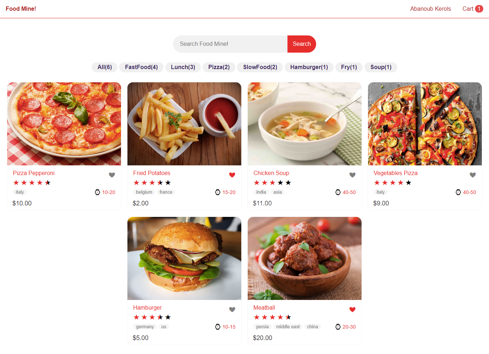
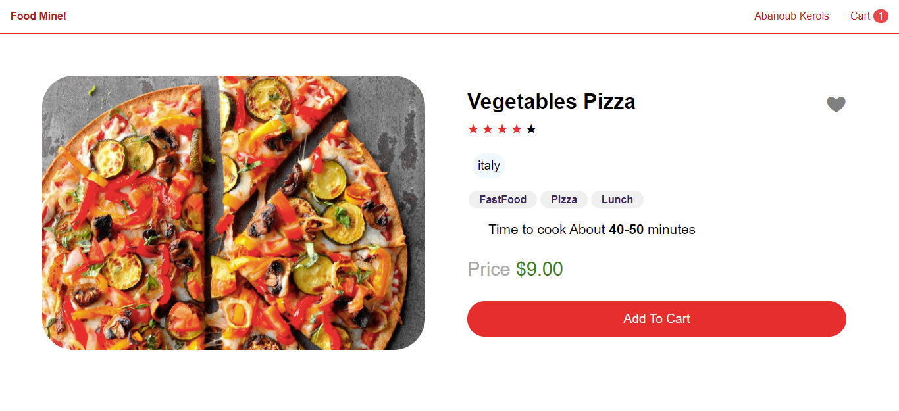

# Angular-Node.js-Project
Mean Stack Application
<h1>Mean Stack App</h1>
<h4><a href="https://meanstackapp.onrender.com/">Project Link</a></h4>
<h3>tools used in front End </h3>
<ul>
 <li>angular routing</li>
 <li>angular guards </li>
 <li>angular service</li>
 <li>angular reactive forms</li>
 <li>angular http client module</li>
 <li>angular interceptor</li>
</ul>
<h3>tools used in back End </h3>
<ul>
 <li>node.js</li>
 <li>express  </li>
 <li>mongoDb</li>
 <li>JWT</li>
 <li>bcrypt</li>

</ul>

